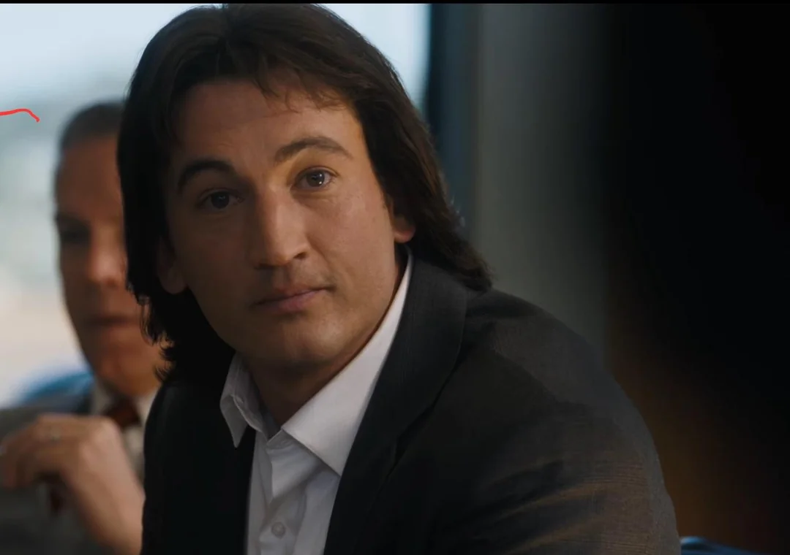

Hola a todos! Les cuento que hoy fui a ver Michael (2026) al IMAX de Vte. López. Así que les traigo una review rápida del cine y de la película!

### Uber
Para empezar, considero primordial contarles que fuimos en auto de aplicación ya que el cine queda lejos de CABA (13 km desde Palermo), así que fuimos en Uber como entenderán.

### Cine
El cine es el Showcase. Primera vez en esta cadena y bastante bien la verdad. Para retirar los pochoclos estuvimos 7 minutos haciendo cola (había solo una persona adelante); creemos que era el primer día del muchacho.
Una vez agarrado el balde y la Coca nos dirigimos a la sala. Gran servicio por parte de los chicos que trabajan ahí, que nos guiaron fácilmente a nuestros asientos.

### La pantalla
Por lo que encontré en internet, la pantalla medía 26 de ancho x 20 de alto, que en comparación con los 13x9 de las pantallas estándar es un salto muy notable. Realmente creo que si la película lo amerita, vale la pena pagar unos pesos más e ir al IMAX. La paja, claro, es la ida y la vuelta, lo que hace que salga 3x lo que costaría una salida al cine normal. De todas formas estimo que hay algún tipo de suscripción que puede hacer la experiencia más barata.

### Michael
La película básicamente sigue la historia del Rey del Pop desde sus inicios en Jackson 5 hasta el último show del Victory Tour. Nos muestra cómo desde joven se destacó por su voz y cómo con ella logró conquistar al mundo entero.

Tiene varios minutos (estimo alrededor de 25) que son solo él cantando en el escenario. Me pareció el tiempo justo, aunque no me habría quejado si era aún más. Quiero destacar la actuación de Jaafar Jackson: es idéntico a Michael, tremendo. Por otro lado, me gustó que Miles Teller hizo de John Branca, fachero el tipo.

Miles Teller as John Branca @Michael (2026)